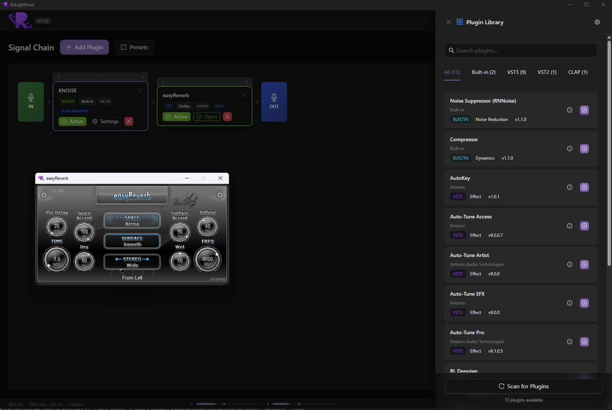

# ReLightHost

> A modern, real-time audio plugin host built with Rust and React — designed for musicians and audio engineers who need low-latency, multi-format plugin processing with a clean, native-feeling UI.


---

## Table of Contents

- [Overview](#overview)
- [Features](#features)
- [Screenshots](#screenshots)
- [Tech Stack](#tech-stack)
- [Getting Started](#getting-started)
  - [Prerequisites](#prerequisites)
  - [Development](#development)
  - [Production Build](#production-build)
- [ASIO Setup (Windows)](#asio-setup-windows)
- [Plugin Support](#plugin-support)
- [Audio Pipeline](#audio-pipeline)
- [Project Structure](#project-structure)
- [Preset & Session Management](#preset--session-management)
- [System Tray](#system-tray)
- [Contributing](#contributing)

---

## Overview

ReLightHost is a lightweight, cross-platform audio plugin host. It lets you load VST2, VST3, and CLAP plugins into a linear processing chain, route audio from any input device through that chain, and output to any output device — all in real time with sub-millisecond latency when using ASIO.

It ships two built-in processors (Compressor and RNNoise-based Noise Suppressor) that require no external plugins, making it useful out of the box even without a plugin library.

---

## Features

- **Multi-format plugin hosting** — VST2 (`.dll`), VST3 (`.vst3`), CLAP (`.clap`), and built-in processors
- **Linear plugin chain** — Drag-and-drop to reorder plugins; per-plugin bypass toggle
- **Native GUI support** — VST3 and VST2 plugins open their original UI in a native Win32 window
- **ASIO / WASAPI / CoreAudio / ALSA / JACK** — Full audio API support via CPAL
- **Virtual output routing** — Mirror audio to a secondary device (e.g. VB-Audio for OBS/Discord)
- **Real-time VU meter** — Live L/R output level monitoring in the footer
- **System stats** — Per-process CPU and RAM usage displayed in real time
- **Preset management** — Save and load named plugin chains (including parameter states and VST3 binary state)
- **Auto-save session** — Plugin chain and audio config restored automatically on next launch
- **System tray** — Minimize to tray, mute toggle, quick-access menu
- **Run on startup** — Optional Windows startup entry
- **Built-in processors** — Compressor (gain/threshold/ratio/attack/release) + RNNoise Noise Suppressor
- **Dark / Light theme** — Persistent theme toggle
- **Plugin crash isolation** — A panicking plugin is caught and bypassed; the host keeps running

---

## Screenshots



---

## Tech Stack

### Frontend
| Technology | Version | Role |
|---|---|---|
| React | 18.3 | UI framework |
| TypeScript | 5.7 | Type safety |
| Vite | 6.0 | Build tool / dev server |
| Ant Design | 6.x | UI component library |
| Zustand | 5.0 | State management |
| TailwindCSS | 3.4 | Utility CSS |

### Backend (Rust)
| Crate | Role |
|---|---|
| `tauri 2.x` | Desktop shell + IPC bridge |
| `cpal 0.15` | Cross-platform audio I/O (ASIO, WASAPI, CoreAudio, ALSA, JACK) |
| `vst3-rs 0.3` | VST3 plugin hosting |
| `vst-rs 0.3` | VST2 plugin hosting |
| `ringbuf 0.4` | Lock-free SPSC ring buffer (audio thread safety) |
| `parking_lot 0.12` | High-performance RwLock / Mutex |
| `nnnoiseless 0.5` | Built-in RNNoise noise suppression |
| `dasp 0.11` | Audio DSP primitives (stereo frame processing) |
| `serde_json` | Preset & config serialization |
| `sysinfo` | Per-process CPU and RAM monitoring |

---

## Getting Started

### Prerequisites

- **Rust** 1.77+ — [rustup.rs](https://rustup.rs)
- **Node.js** 18+ and **pnpm** — `npm install -g pnpm`
- **Tauri CLI** — installed automatically via pnpm
- **Windows SDK** (Windows builds) — required for native Win32 GUI hosting
- **ASIO SDK** (optional, Windows) — see [ASIO Setup](#asio-setup-windows)

### Development

```bash
# Install frontend dependencies
pnpm install

# Start the app in development mode (Vite HMR + Tauri dev window)
pnpm tauri dev
```

### Production Build

```bash
# Build frontend + compile Rust in release mode
pnpm tauri build
```

Output binaries will be in `src-tauri/target/release/`. Installers (NSIS `.exe` / MSI) are placed in `src-tauri/target/release/bundle/`.

---

## ASIO Setup (Windows)

ASIO provides the lowest possible audio latency on Windows. To enable it:

1. Download the **ASIO SDK** from [Steinberg's developer portal](https://www.steinberg.net/developers/).
2. Extract it somewhere, e.g. `C:\ASIO_SDK`.
3. Set the environment variable before building:
   ```powershell
   $env:CPAL_ASIO_DIR = "C:\ASIO_SDK"
   ```
4. Run `pnpm tauri dev` or `pnpm tauri build` as normal.

Without ASIO, ReLightHost falls back to WASAPI (Windows), which still works but has higher latency.

---

## Plugin Support

| Format | Extension | GUI | State |
|---|---|---|---|
| VST3 | `.vst3` | Native Win32 (`IPlugView`) | Binary blob (`IComponent::getState`) |
| VST2 | `.dll` | Plugin-provided | Parameters |
| CLAP | `.clap` | Custom | Plugin state |
| Built-in | — | React (Ant Design) | Parameters in preset JSON |

### Default Scan Paths (Windows)

```
C:\Program Files\Common Files\VST3
C:\Program Files\Common Files\CLAP
%LOCALAPPDATA%\Programs\Common\VST3
%LOCALAPPDATA%\Programs\Common\CLAP
```

Custom scan directories can be added in the **Plugin Settings** dialog (⚙ icon).

### Plugin Crash Protection

Plugins are wrapped with `catch_unwind`. If a plugin panics:
- The crash is logged
- That plugin instance switches to pass-through mode
- The rest of the chain continues processing normally

---

## Audio Pipeline

```
Input Device (CPAL stream)
        │
        ▼
Lock-free ring buffer (SPSC)
        │
        ▼
Audio callback (realtime thread)
  ┌─────────────────────────────┐
  │  Mute check (AtomicBool)    │
  │           │                 │
  │  Plugin chain processing    │
  │   ┌────────────────────┐   │
  │   │ Plugin 1 (L/R)     │   │
  │   │ Plugin 2 (L/R)     │   │
  │   │ ...                │   │
  │   └────────────────────┘   │
  │  (bypassed plugins pass     │
  │   audio unchanged)          │
  │           │                 │
  │   VU meter sampling         │
  └─────────────────────────────┘
        │
        ├──► Primary output device
        └──► Virtual output device (optional)
```

**Latency** is determined by buffer size and sample rate:

$$\text{latency (ms)} = \frac{\text{buffer\_size}}{\text{sample\_rate}} \times 1000$$

Example: 1024 samples @ 48 kHz = **21.3 ms**

ASIO with a 128-sample buffer @ 48 kHz = **2.7 ms**

---

## Project Structure

```
ReLightHost/
├── src/                        # Frontend (React + TypeScript)
│   ├── App.tsx                 # Root component; session restore logic
│   ├── main.tsx                # Entry point; context menu block
│   ├── index.css               # Global styles
│   ├── components/
│   │   ├── Layout.tsx          # Shell: header + footer (VU meter, stats, latency)
│   │   ├── Header.tsx          # App bar: logo, mute, theme, audio/app settings
│   │   ├── PluginChain.tsx     # IN → [Plugin1] → [Plugin2] → OUT (drag & drop)
│   │   ├── PluginCard.tsx      # Per-plugin card: bypass, info, open GUI
│   │   ├── PluginLibrary.tsx   # Browse & search available plugins; add to chain
│   │   ├── PluginSettings.tsx  # Custom scan path management + plugin rescan
│   │   ├── PluginInfoModal.tsx # Plugin metadata viewer
│   │   ├── AudioSettings.tsx   # Device, sample rate, buffer size configuration
│   │   ├── AppSettings.tsx     # Startup & tray options; about info
│   │   ├── PresetManager.tsx   # Save / load / delete named presets
│   │   ├── VUMeter.tsx         # Real-time L/R dB bar meter
│   │   ├── CompressorGui.tsx   # Built-in compressor UI
│   │   └── NoiseSuppressorGui.tsx  # Built-in noise suppressor UI
│   ├── stores/
│   │   ├── audioStore.ts       # Audio device, SR, buffer, monitoring state
│   │   ├── pluginStore.ts      # Plugin library, active chain, scan state
│   │   ├── presetStore.ts      # Preset list
│   │   └── themeStore.ts       # Dark/light theme persistence
│   └── lib/
│       ├── tauri.ts            # All Tauri IPC command wrappers
│       ├── types.ts            # Shared TypeScript type definitions
│       └── index.ts            # Re-exports
│
├── src-tauri/                  # Backend (Rust)
│   ├── src/
│   │   ├── lib.rs              # AppState, Tauri command handlers, tray setup
│   │   ├── main.rs             # Entry point
│   │   ├── config.rs           # JSON config persistence (audio settings, app options)
│   │   ├── preset.rs           # Preset serialization/deserialization
│   │   ├── audio/
│   │   │   ├── manager.rs      # CPAL stream lifecycle; monitoring toggle
│   │   │   ├── device.rs       # Device enumeration
│   │   │   ├── types.rs        # AudioStatus, AudioConfig, AudioDeviceInfo
│   │   │   └── vu_meter.rs     # Peak / RMS level tracking
│   │   └── plugins/
│   │       ├── scanner.rs      # VST/CLAP directory scanner
│   │       ├── instance.rs     # Per-plugin instance wrapper
│   │       ├── types.rs        # PluginInfo, PluginInstanceInfo, PluginFormat
│   │       ├── vst3_processor.rs
│   │       ├── vst3_gui.rs
│   │       ├── vst2_processor.rs
│   │       ├── vst2_gui.rs
│   │       ├── crash_protection.rs
│   │       └── builtin/
│   │           ├── compressor.rs
│   │           └── noise_suppressor.rs
│   ├── Cargo.toml
│   └── tauri.conf.json
│
├── package.json
├── vite.config.ts
└── tailwind.config.js
```

---

## Preset & Session Management

### Presets

Presets are JSON files stored in the app data directory:

- **Windows:** `%APPDATA%\ReLightHost\presets\`
- **macOS/Linux:** `~/.config/ReLightHost/presets/`

Each preset captures the full plugin chain state:

```json
{
  "name": "My Chain",
  "created_at": "2026-03-12T10:00:00Z",
  "plugin_chain": [
    {
      "plugin_id": "vst3_fabfilter_pro-c2",
      "plugin_name": "Pro-C 2",
      "plugin_vendor": "FabFilter",
      "plugin_format": "vst3",
      "bypassed": false,
      "parameters": [
        { "id": 0, "name": "Threshold", "value": -18.0 }
      ],
      "vst3_state": "<base64 binary blob>"
    }
  ]
}
```

### Auto-save

Every change to the plugin chain (add, remove, reorder, bypass toggle) triggers an auto-save to the `__autosave__` preset. On the next app launch, this chain is automatically restored.

### Session Restore Sequence

1. `restore_session()` Tauri command is called on startup
2. Audio config (device, SR, buffer) is restored from `config.json`
3. Plugin chain is restored from `__autosave__` preset
4. Audio stream is started (with a 2-second delay for Voicemeeter ASIO devices)
5. Frontend syncs its stores from the restored backend state

---

## System Tray

When **Minimize to Tray** is enabled (Application Settings → Minimize to Tray), closing the window hides the app to the system tray instead of quitting.

### Tray Context Menu

| Item | Action |
|---|---|
| Show ReLightHost | Restore and focus the main window |
| Mute Audio / Unmute Audio | Toggle output mute |
| Audio Settings… | Open Audio Settings dialog |
| Application Settings… | Open App Settings dialog |
| Exit | Quit the application |

The tray icon tooltip changes to **"ReLightHost (Muted)"** when muted.

---

## Contributing

Contributions are welcome! Please open an issue first to discuss the change before submitting a pull request.

```bash
# Run type checks
pnpm tsc --noEmit

# Run Rust checks
cd src-tauri && cargo check
```

---

*Made with ❤️ by Gyn*
