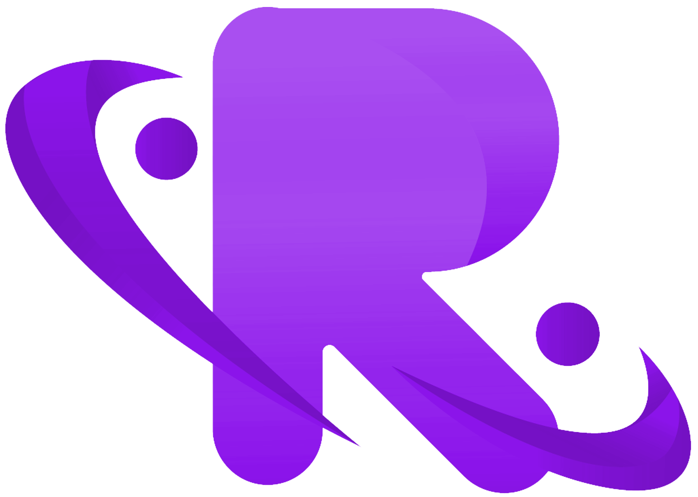
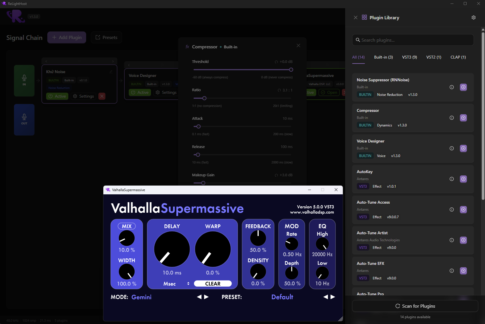

<div align="center">

<h1> ReLightHost</h1>

**A real-time audio plugin host built with Rust, React, and Tauri**

ReLightHost is a desktop audio host for loading external plugins into a linear chain, routing live audio through them, and managing the whole session from a native Tauri app.

[](https://github.com/hiimgyn/ReLightHost)
[](https://github.com)
[](https://www.rust-lang.org)
[](https://tauri.app)

</div>

---

## Overview

ReLightHost is a lightweight plugin host with a focus on live audio routing, session restore, and a clean workflow for managing plugins. It supports VST3, VST2, CLAP, and built-in processors, and it keeps the audio chain, device configuration, mute state, and loopback state in sync with the backend.

The app is centered around a drag-and-drop signal chain, a searchable plugin library, native plugin GUI support where available, and a footer that surfaces latency, plugin count, CPU, RAM, and VU metering in real time.

---

## Features

| Feature | Description |
|---|---|
| Plugin chain | Add, remove, reorder, swap, bypass, and rename plugins in a linear processing chain |
| Plugin library | Search, filter, and group plugins by manufacturer before adding them to the chain |
| Multi-format support | VST3, VST2 (.dll), CLAP, and built-in processors |
| Native GUI support | Open plugin editors in native windows when the plugin exposes one |
| Audio routing | Select input/output devices, monitor live audio, and toggle hardware loopback |
| Real-time meters | Live VU meter plus CPU and RAM monitoring in the app footer |
| Session restore | Restore audio settings and plugin state on launch |
| Auto-save | Structural chain changes are persisted automatically |
| System tray | Minimize to tray and restore from the tray menu |
| Startup options | Windows startup registration and show-hidden behavior on launch |
| Theme support | Persistent dark and light theme toggle |
| Built-in processors | Compressor, noise suppressor, and voice EQ are bundled with the host |

---

## Screenshot



---

## Tech Stack

<details>
<summary><strong>Frontend</strong></summary>
<br>

| Technology | Role |
|---|---|
| React | UI framework |
| TypeScript | Type safety |
| Vite | Build tool and dev server |
| Ant Design | Component library |
| Zustand | State management |
| Tailwind CSS | Utility styling |

</details>

<details>
<summary><strong>Backend</strong></summary>
<br>

| Technology | Role |
|---|---|
| Tauri 2 | Desktop shell and IPC bridge |
| CPAL | Cross-platform audio I/O |
| vst3-rs | VST3 hosting |
| vst-rs | VST2 hosting |
| ringbuf | Lock-free audio buffers |
| parking_lot | Fast synchronization primitives |
| nnnoiseless | Built-in noise suppression |
| serde_json | Session and preset serialization |
| sysinfo | CPU and RAM monitoring |

</details>

---

## Getting Started

### Prerequisites

- Node.js 20+
- pnpm 9+
- Rust stable 1.77+
- Tauri CLI v2
- Windows only: Visual Studio Build Tools with the C++ workload

### Install and Run

```powershell
pnpm install
pnpm tauri dev
```

### Build

```powershell
pnpm tauri build
```

Optional checks:

```powershell
pnpm build
cd src-tauri
cargo check
cargo clippy --all-targets --all-features -- -D warnings
```

### Release Signing

If you build signed updater artifacts, set `TAURI_SIGNING_PRIVATE_KEY` before running a release build. If the key is password-protected, also set `TAURI_SIGNING_PRIVATE_KEY_PASSWORD`.

```powershell
$env:TAURI_SIGNING_PRIVATE_KEY = @"
PASTE_YOUR_PRIVATE_KEY_HERE
"@
pnpm tauri build
```

---

## Audio Notes

ReLightHost uses CPAL for device I/O, so the available backends depend on the platform and installed drivers. On Windows, ASIO is the lowest-latency path when available, while WASAPI is the fallback.

If you want ASIO on Windows, set `CPAL_ASIO_DIR` to the location of the Steinberg ASIO SDK before building.

```powershell
$env:CPAL_ASIO_DIR = "C:\ASIO_SDK"
```

---

## Plugin Support

| Format | Extension | GUI | Notes |
|---|---|---|---|
| VST3 | `.vst3` | Native when supported | Stores plugin binary state |
| VST2 | `.dll` | Plugin-provided | Parameter-based state persistence |
| CLAP | `.clap` | Plugin-provided | Native plugin format support |
| Built-in | - | React UI | Bundled processors shipped with the app |

### Default Scan Paths

Windows:

```
C:\Program Files\Common Files\VST3
C:\Program Files\VSTPlugins
C:\Program Files\Steinberg\VSTPlugins
C:\Program Files\Common Files\CLAP
%LOCALAPPDATA%\Programs\Common\CLAP
%LOCALAPPDATA%\Programs\Common\VST2
```

macOS:

```
/Library/Audio/Plug-Ins/VST3
/Library/Audio/Plug-Ins/VST
/Library/Audio/Plug-Ins/CLAP
~/Library/Audio/Plug-Ins/VST3
~/Library/Audio/Plug-Ins/VST
~/Library/Audio/Plug-Ins/CLAP
```

Linux:

```
/usr/lib/vst3
/usr/lib/vst
/usr/lib/clap
~/.vst3
~/.vst
~/.clap
```

Custom directories can be added from Plugin Settings.

---

## Built-in Processors

The bundled processors are compiled into the host, so you can use them without installing external plugins.

### Compressor

Feed-forward RMS compressor with soft-knee and parallel mix.

### Noise Suppressor

RNNoise-based speech noise suppression with mix, gate, and output gain controls.

### Voice EQ

Three-band EQ with drive, stereo width, and output ceiling controls.

---

## Project Structure

```
ReLightHost/
├── src/                 # Frontend (React + TypeScript)
│   ├── App.tsx          # Session restore and window lifecycle
│   ├── components/     # Layout, chain, audio, plugin, settings, GUI panels
│   ├── stores/         # Zustand state stores
│   └── lib/            # Tauri wrappers and shared types
└── src-tauri/           # Backend (Rust)
    ├── src/lib.rs      # App state, commands, tray setup
    ├── bootstrap/      # Window and tray bootstrapping
    ├── commands/       # IPC commands
    ├── core/           # Session, autosave, timing, threading
    ├── domain/         # Config and preset models
    └── plugins/        # Built-in processors and plugin hosting
```

---

## Contributing

Contributions are welcome. Open an issue first if you want to discuss a larger change.

```bash
pnpm build
cd src-tauri && cargo check
```

---

<div align="center">

Made with 💖 by Gyn

</div>
