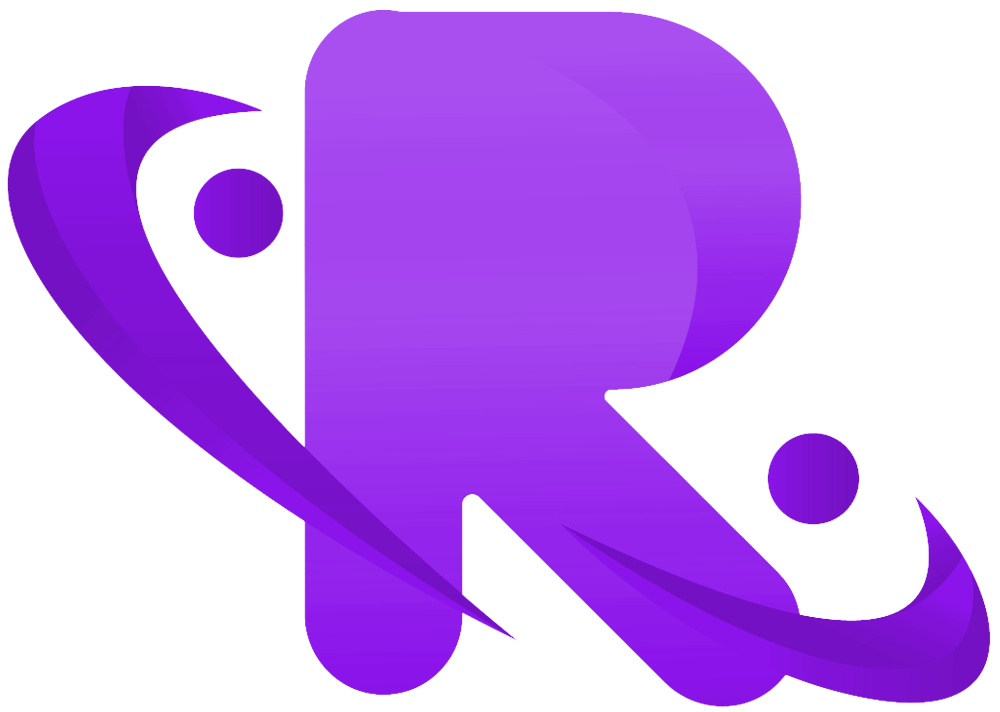
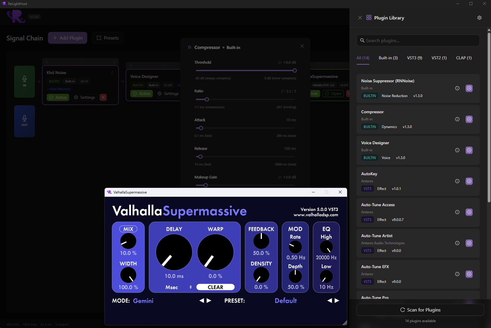

<div align="center">

<h1> ReLightHost</h1>

**A real-time audio plugin host built with Rust, React, and Tauri**

ReLightHost is a desktop audio host for loading external plugins into a linear chain, routing live audio through them, and managing the whole session from a native Tauri app.

[](https://github.com/hiimgyn/ReLightHost)
[](https://github.com)
[](https://www.rust-lang.org)
[](https://tauri.app)

</div>

---

## Overview

ReLightHost is a lightweight plugin host with a focus on live audio routing, session restore, and a clean workflow for managing plugins. It supports VST3, VST2, CLAP, and built-in processors, and it keeps the audio chain, device configuration, mute state, and loopback state in sync with the backend.

The app is centered around a drag-and-drop signal chain, a searchable plugin library, native plugin GUI support where available, and a footer that surfaces latency, plugin count, CPU, RAM, and VU metering in real time.

VST3, VST2, and CLAP hosting are all implemented as raw FFI against each format's native ABI — no host-side SDK dependency for any of the three. Plugin GUI windows embed natively (Win32 `HWND`, cross-process where relevant) instead of any web-based or remote-rendered approach.

> **Platform note:** the audio/plugin-hosting backend (ASIO/WASAPI via CPAL, VST3/VST2/CLAP hosting, native GUI embedding) is Windows-only today. The project builds on other platforms but plugin hosting is stubbed out there.

---

## Features

| Feature | Description |
|---|---|
| Plugin chain | Add, remove, reorder, swap, bypass, and rename plugins in a linear processing chain |
| Plugin library | Search, filter, and group plugins by manufacturer before adding them to the chain |
| Multi-format support | VST3, VST2 (.dll), CLAP, and built-in processors — all hosted via raw FFI, no per-format SDK dependency |
| Native GUI support | Open plugin editors in native windows when the plugin exposes one |
| VST3 crash isolation | A VST3 plugin that repeatedly crashes the host gets automatically reloaded in an isolated child process on subsequent launches, so a fragile plugin can no longer take the whole app down |
| Audio routing | Select input/output devices, monitor live audio, and toggle hardware loopback |
| Real-time meters | Live VU meter plus CPU and RAM monitoring in the app footer |
| Session restore | Restore audio settings and plugin state on launch |
| Auto-save | Structural chain changes are persisted automatically |
| System tray | Minimize to tray, restore from the tray, and a full iconized tray menu (mute/monitor-output toggles reflect live state) |
| Startup options | Windows startup registration and show-hidden behavior on launch |
| Theme support | Persistent dark and light theme toggle |
| Built-in AI & DSP processors | DeepFilterNet 3 (AI SOTA speech denoiser), Compressor, RNNoise, and Voice Designer |
| Pro-Audio Modern GUI | Metal rotary dials (`AudioKnob` with 5x fine-tuning), interactive dynamic transfer curves, 3-band Bode plots, dual oscilloscopes, and neural VAD orbs |

---

## Screenshot



---

## Tech Stack

<details>
<summary><strong>Frontend</strong></summary>
<br>

| Technology | Role |
|---|---|
| React 19 | UI framework |
| TypeScript | Type safety |
| Vite 8 | Build tool and dev server |
| Ant Design 6 | Component library |
| Zustand | State management |
| Tailwind CSS 4 | Utility styling |

</details>

<details>
<summary><strong>Backend</strong></summary>
<br>

| Technology | Role |
|---|---|
| Tauri 2 | Desktop shell and IPC bridge |
| CPAL | Cross-platform audio I/O (ASIO/WASAPI on Windows) |
| vst3-rs | VST3 hosting bindings |
| Raw FFI (no crate) | VST2 hosting — direct `AEffect`/dispatcher ABI, no SDK dependency |
| Raw FFI (no crate) | CLAP hosting — direct C ABI, no SDK dependency |
| windows-sys | Native Win32 interop — window embedding, tray, DPI, process/job management |
| ringbuf | Lock-free audio buffers |
| parking_lot | Fast synchronization primitives |
| deep_filter & tract | DeepFilterNet 3 ONNX neural inference engine with dedicated MMCSS Pro Audio worker thread |
| nnnoiseless | Built-in RNNoise suppression |
| serde / serde_json | Session, preset, and IPC serialization |
| sysinfo | CPU and RAM monitoring |

</details>

---

## Getting Started

### Prerequisites

- Node.js 20+
- pnpm 9+
- Rust stable 1.77+
- Tauri CLI v2
- Windows only: Visual Studio Build Tools with the C++ workload

### Install and Run

```powershell
pnpm install
pnpm tauri dev
```

### Build

```powershell
pnpm tauri build
```

Optional checks:

```powershell
pnpm build
cd src-tauri
cargo check
cargo clippy --all-targets --all-features -- -D warnings
cargo test
```

### Release Signing

If you build signed updater artifacts, set `TAURI_SIGNING_PRIVATE_KEY` before running a release build. If the key is password-protected, also set `TAURI_SIGNING_PRIVATE_KEY_PASSWORD`.

```powershell
$env:TAURI_SIGNING_PRIVATE_KEY = @"
PASTE_YOUR_PRIVATE_KEY_HERE
"@
pnpm tauri build
```

---

## Audio Notes

ReLightHost uses CPAL for device I/O. On Windows, ASIO is the lowest-latency path when available, while WASAPI is the fallback.

If you want ASIO on Windows, set `CPAL_ASIO_DIR` to the location of the Steinberg ASIO SDK before building.

```powershell
$env:CPAL_ASIO_DIR = "C:\ASIO_SDK"
```

---

## Plugin Support

| Format | Extension | Hosting | GUI | Notes |
|---|---|---|---|---|
| VST3 | `.vst3` | `vst3-rs` (COM/vtable bindings) | Native when supported | Binary state persistence; repeatedly-crashing plugins are auto-sandboxed in a child process on later loads |
| VST2 | `.dll` | Raw FFI, no crate | Plugin-provided, native window | Chunk-based state persistence (`effGetChunk`/`effSetChunk`) |
| CLAP | `.clap` | Raw FFI, no crate | Plugin-provided | Native plugin format support |
| Built-in | - | Native Rust DSP | React UI | Bundled processors shipped with the app |

### Default Scan Paths

Windows:

```
C:\Program Files\Common Files\VST3
C:\Program Files\VSTPlugins
C:\Program Files\Steinberg\VSTPlugins
C:\Program Files\Common Files\CLAP
%LOCALAPPDATA%\Programs\Common\CLAP
%LOCALAPPDATA%\Programs\Common\VST2
```

Custom directories can be added from Plugin Settings.

---

## Crash Resilience

A plugin crashing the whole app is the worst failure mode for a live audio host, so ReLightHost layers a few defenses:

- **Panic protection** — Rust-side panics inside a plugin call are caught and turned into a bypass instead of taking the process down.
- **Per-block safety** — the plugin chain never blocks the real-time audio callback waiting on a plugin; a busy or slow plugin is skipped for that block rather than causing an underrun.
- **VST3 sandboxing** — a native crash (access violation, heap corruption) in a plugin's own compiled code can't be caught in-process at all. ReLightHost tracks crash history per VST3 plugin across app restarts, and once a plugin crosses the crash threshold it's loaded inside a dedicated `vst3_sandbox_host.exe` child process instead — audio and GUI both keep working exactly as before, but a crash there only takes down that child, not the app.

---

## Built-in Processors & Pro-Audio GUI

The bundled processors are compiled directly into the host with dedicated low-latency algorithms and high-end hardware-inspired visual editors (rotary knobs with 5x precision `Shift` fine-tuning, dynamic interactive curves, real-time oscilloscopes, and neural energy meters):

### AI Noise Suppressor (DeepFilterNet 3 Pro)

State-of-the-Art speech enhancement powered by [DeepFilterNet 3](https://github.com/Rikorose/DeepFilterNet) with deep complex-valued spectrogram filtering and ERB psychoacoustic denoising.
- **Embedded low-latency model** (`DeepFilterNet3_ll_onnx` at 10ms frame hop, 48 kHz).
- **Lock-free real-time audio isolation**: In-flight audio never blocks; neural inference executes asynchronously on an MMCSS *Pro Audio* priority worker thread via lock-free SPSC ring buffers.
- **Visuals & Controls**: High-res dual oscilloscope (raw noise floor vs clean voice), pulsating neural VAD speech energy orb, max attenuation limit (0–60 dB), post-filter beta threshold, wet/dry mix, and output trim.

### Compressor Pro

Feed-forward RMS compressor with quadratic soft-knee, makeup gain, and parallel wet/dry mixing.
- **Visuals & Controls**: Interactive dynamic transfer curve with draggable knee threshold handle, real-time audio dot tracker, 1:1 unity line, and vertical Gain Reduction (GR) meter.

### Voice Designer

Four-stage vocal enhancement channel strip:
- **3-Band Semi-Parametric EQ**: Interactive 20Hz–20kHz logarithmic Bode plot canvas with draggable Low (200Hz), Mid (2kHz), and High (8kHz) gain nodes.
- **Tape Saturation (Drive)**: Harmonic warmth generation.
- **Stereo Doubler (Width)**: Haas-effect stereo widening.
- **Limiter (Ceiling)**: Brickwall peak protection (-12 dB to 0 dB).

### Noise Suppressor (RNNoise)

Ultra-lightweight classic neural speech denoiser powered by RNNoise with live dual-layer oscilloscope, neural VAD orb, gating threshold, and gain compensation.

---

## Project Structure

```
ReLightHost/
├── src/                        # Frontend (React + TypeScript)
│   ├── App.tsx                 # Session restore and window lifecycle
│   ├── components/             # Layout, chain, audio, plugin, settings, GUI panels
│   ├── stores/                 # Zustand state stores
│   └── lib/                    # Tauri wrappers and shared types
└── src-tauri/                  # Backend (Rust)
    ├── src/
    │   ├── lib.rs               # App state, commands, tray setup
    │   ├── bin/                 # vst3_sandbox_host.exe — sandboxed VST3 child process
    │   ├── bootstrap/           # Window and tray bootstrapping
    │   ├── commands/            # IPC commands
    │   ├── core/                # Session, autosave, timing, threading
    │   ├── domain/               # Config and preset models
    │   └── plugins/
    │       ├── core/             # Scanner, instance manager, crash protection
    │       ├── processor/        # VST3 / VST2 / CLAP hosting (raw FFI)
    │       │   └── vst3_sandbox/ # Out-of-process VST3 host: protocol + registry
    │       ├── gui/               # Native plugin editor window embedding
    │       └── builtin/          # Compressor, noise suppressor, Voice Designer
    └── icons/tray/               # Tray menu icons
```

---

## Contributing

Contributions are welcome. Open an issue first if you want to discuss a larger change.

```bash
pnpm build
cd src-tauri && cargo check
```

---

<div align="center">

Made with 💖 by Gyn

</div>
